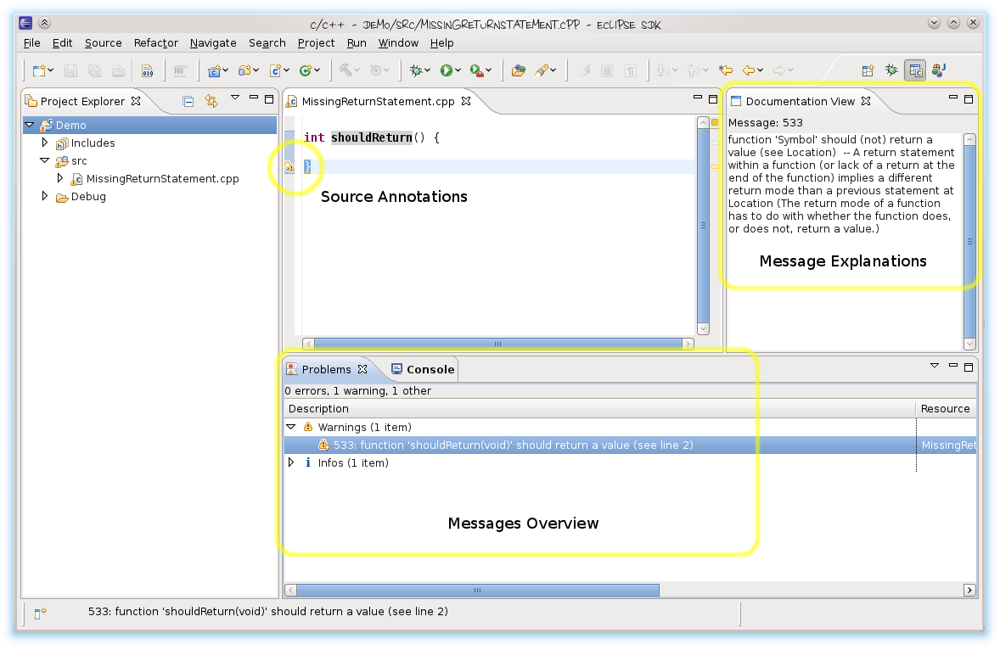

# Linticator

[Lint](http://www.gimpel.com/html/products.htm) provides valuable *feedback on* programming *style* and common programmer *mistakes*. Our Linticator plug-in for [Eclipse CDT](http://eclipse.org/cdt) runs Lint (PC-lint Plus, Flexe/PC-Lint) and annotates your source code with Lint messages. For some messages, we provide quickfixes that let you *quickly correct a warning*.

## Find Your Bugs

Linticator reports problems [directly in your source code view](/docs/user_guide.md), allowing you to get rid of them quickly.

## Let Linticator Fix Your Bugs

Linticator's outstanding quick-fixes resolve potential bugs [with a single mouse-click](/docs/features.md). Found a false positive? Simply mute it with one of our quick-fixes.

## Integrated Lint Documentation

Not sure what a lint message means? Linticator automatically shows you the official [documentation for all Lint messages](/docs/features.md).

## Simpler to Use

Linticator automatically configures Lint with your Eclipse CDT Project settings, unburdening you from manually maintaining the configuration. 

## Cross Platform

Linticator runs on Linux, Mac OS X, Solaris, and Windows. Linticator runs on Eclipse 3.8 (Eclipse 2012 Release "Juno") and later releases (we tested up to Eclipse Oxygen). Linticator is compatible with commercial Eclipse-based IDEs like Freescale's CodeWarrior and can run FlexeLint, PC-lint and PC-lint Plus.

## And More ...

More information on Linticator can be found in the [User Guide](/docs/user_guide.md) or you can take a look at some screenshots in a short tour on [Linticators Features](/docs/features.md) and the [Installation Instructions](/docs/installation.md).

## Licensing

Linticator is licensed under the [Eclipse Public License - v 2.0](./LICENSE.txt). All product names, logos, and brands are property of their respective owners. All company, product and service names used in this website are for identification purposes only. Use of these names, logos, and brands does not imply endorsement.